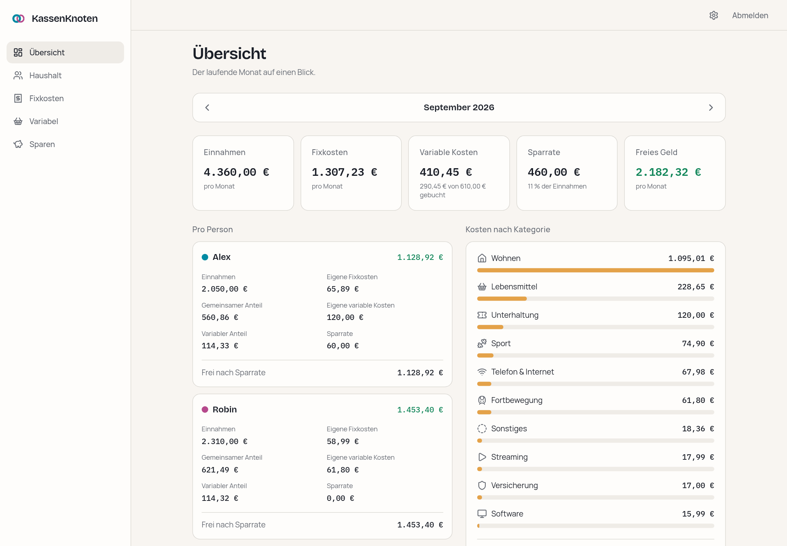
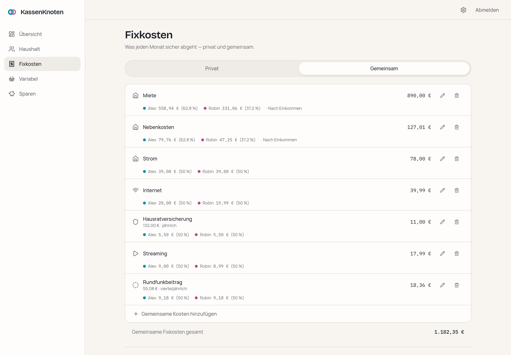
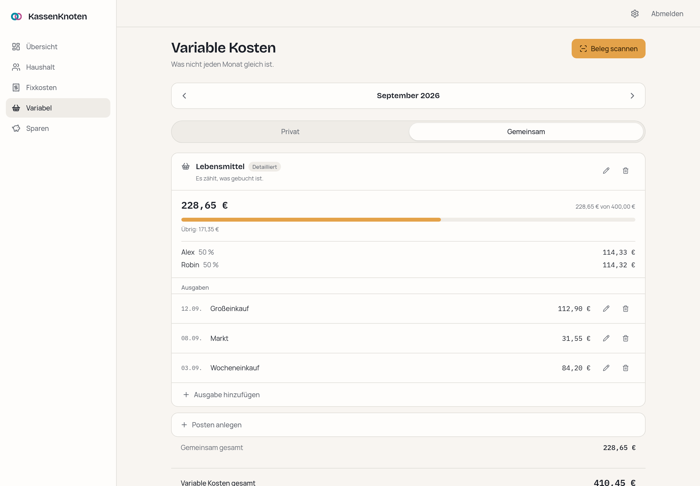
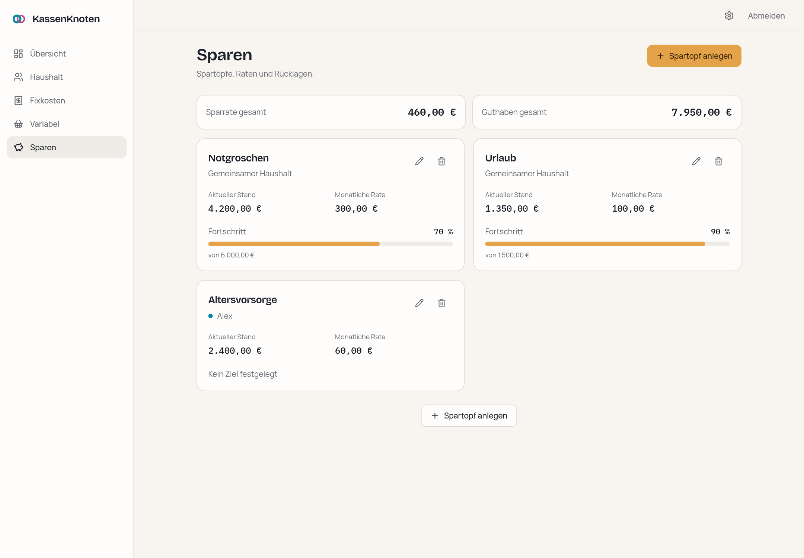
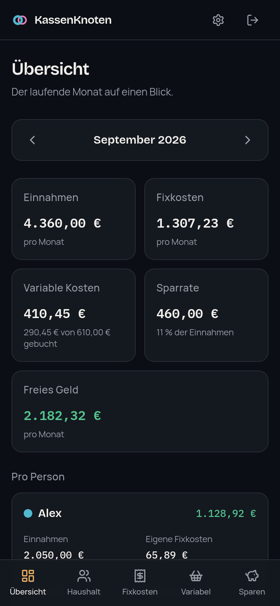

<div align="center">


# KassenKnoten

### Zwei Einkommen, ein Haushalt, ein klarer Plan.

A self-hosted household finance planner for people who share costs unevenly —
and want the maths to be exactly right.

**[→ See it in action](https://jankln.github.io/KassenKnoten/)** · [Features](#what-it-does) · [Run it](#run-it) · [Security](#security)

[](LICENSE)
[](https://github.com/jankln/KassenKnoten/releases/latest)
[](#run-it)
[](#contributing)
[](#a-note-on-language)

</div>

<br>



<br>

## The problem it solves

Two people earning different amounts share a flat. Rent should be split by income,
the electricity bill down the middle, the insurance is billed once a year, and one of
them pays for a gym the other never uses.

Every tool gets this half right. Splitting apps assume one rule for everything.
Spreadsheets can express it, but one wrong cell and the formula is quietly broken for
months. KassenKnoten makes the split **a deliberate choice per item**, computes it to
the cent, and shows both people what it actually costs them — while they type.

<br>

## What it does

|                               |                                                                                                             |
| ----------------------------- | ----------------------------------------------------------------------------------------------------------- |
| **Split per item**            | Fixed quota or proportional to income, chosen for each cost. The household default only pre-fills the form. |
| **Exact to the cent**         | Integer cents, basis points, largest-remainder splitting. No float ever touches money.                      |
| **A real time dimension**     | Every entry knows the months it applies to. A raise in September leaves August reporting August.            |
| **Variable budgets**          | Groceries, fuel, going out — counted as a plan, or receipt by receipt with a date.                          |
| **Every interval normalised** | A 132,00 € yearly insurance sits next to everything else as 11,00 € a month.                                |
| **Savings pots**              | Monthly rate, balance, optional target, owned by a person or by the household.                              |
| **Dashboard and trend**       | The month at a glance, per person, per category — and the line each month draws over time.                  |
| **Installable as an app**     | Own icon, no address bar, and an honest offline screen instead of stale figures.                            |
| **Two-factor sign-in**        | Optional TOTP from any authenticator app, on top of the household password.                                 |
| **Your data stays yours**     | One SQLite file on your volume, versioned JSON backups, CSV export, restore in one transaction.             |

<br>

### Split each cost its own way

Fixed quota or proportional to income, **chosen per item, never assumed**. Every shared
cost shows who pays what and _why_ — rent by income, electricity down the middle. The
preview while you type is computed by the very same function that later saves, because a
preview that calculates a second way is a preview that can disagree with the result.



### Get the cents right

Every amount is stored as integer cents, every share as basis points, and splits use the
largest-remainder method — so 39,99 € at 50/50 becomes 20,00 € and 19,99 €, never
39,98 € or 40,00 €. No floating point touches money anywhere in the codebase, and the
calculation engine is a pure, unit-tested module.

### Keep the past honest

Every income and fixed cost carries the months it applies to. Giving someone a raise in
September leaves August reporting August, and the dashboard steps back through the months
to show what each one actually was. When an amount changes the app **asks what that
means** — a new figure from a month on, or a correction to what was always true — and
shows the resulting rows before saving.

### Plan the parts that move

Each variable cost gets a budget, and you choose per budget how it is kept. **Plan**
counts the figure you set and asks nothing more of you. **Detailliert** counts what you
actually booked, receipt by receipt with a date, and turns the plan into a budget to
measure against. Both are split between you the same way fixed costs are, and both land
on the dashboard.



### Save on purpose, and stay out of trouble

Savings pots with a monthly rate, a balance and an optional target. Negative free cash, a
savings rate above income, a pot past its target, an overspent budget — surfaced as calm
banners, not modal scolding. Deleting shows a "Rückgängig" toast instead of asking "are
you sure?".



<br>

<table>
<tr>
<td width="50%" valign="top">



</td>
<td width="50%" valign="top">


</td>
</tr>
<tr>
<td valign="top"><sub>Designed at 375 px first. Same features, not a shrunken desktop — and it installs to the home screen.</sub></td>
<td valign="top"><sub>Optional second factor: a six-digit code from any authenticator app, refused once it has been used.</sub></td>
</tr>
</table>

<br>

## Run it

You need Docker and about two minutes.

```bash
git clone https://github.com/jankln/KassenKnoten.git
cd KassenKnoten
cp .env.example .env

# a session secret
echo "SESSION_SECRET=$(openssl rand -base64 32)" >> .env

# your household password, hashed — paste the printed line into .env
npm run auth:hash

# optional: a second factor. Prints a QR code to scan and the line for .env
npm run auth:totp

docker compose up -d
```

Open <http://127.0.0.1:3000> and a three-step wizard sets up the household. The database
is created, migrated and seeded on first use — there is no separate migration step, and
upgrading is `git pull && docker compose up -d --build`.

Compose binds to localhost on purpose: put a reverse proxy in front for TLS, forward
`X-Forwarded-Proto` and `X-Forwarded-For`, and set `APP_URL` to the public HTTPS address
before anyone signs in.

## Security

One shared household password, hashed with **argon2id** at OWASP interactive parameters
and supplied through the environment — a copy of the database is not a copy of the
password. Sign-in attempts are throttled per client.

Optionally a **second factor**: set `TOTP_SECRET` and the login also asks for a six-digit
code from any authenticator app (RFC 6238, verified against the RFC's own test vectors).
A code is refused once it has been used, so one read over your shoulder is not one that
still works. The secret lives in the environment like the password does, which means
losing the phone is not a lockout and there are no recovery codes to keep safe.

The session is an **encrypted** cookie (JWE, A256GCM, key derived via HKDF), `httpOnly`,
`SameSite=Lax`, and `Secure` whenever the request arrived over HTTPS. Every route except
the login page and the health check is denied without a valid session — deny by default,
so a new page cannot accidentally be public — and server actions re-check server-side.

Every response carries a **Content-Security-Policy with a per-request nonce**, plus
`frame-ancestors 'none'`, `Referrer-Policy`, `X-Content-Type-Options`, a
`Permissions-Policy` denying camera, microphone and location, and HSTS over HTTPS.
Nothing loads from another origin — fonts included.

The container runs as an unprivileged user. Members are plain data records; adding
someone to the household does not create an account.

## Built with

Next.js 16 (App Router, Turbopack) · TypeScript · Tailwind CSS · SQLite via Drizzle ORM ·
argon2id · Vitest. No animation library, no CDN, no telemetry, no external calls at
runtime.

## Status

**Stable — 1.0.0.** Everything described above works and is in daily use. The data model,
the backup format and the environment variables are settled; from here they change by
migration, not by surprise, and breaking changes wait for a major version.

Planned: OIDC sign-in against Authentik with an e-mail allowlist. Until it exists,
`AUTH_MODE` refuses the value rather than silently locking a household out of their own
finances.

## A note on language

The interface is **German**, from the first label to the last error message — and so is
the [landing page](https://jankln.github.io/KassenKnoten/), because it advertises a German
product. The code, the documentation and this README are English, so anyone can run and
modify it.

## Contributing

Issues and pull requests are welcome. `docs/PLAN.md` covers the architecture and data
model, `docs/design.md` the visual direction and the reasoning behind it, and
`docs/WORKFLOW.md` how changes are made.

`npm run check` — typecheck, lint, format and 280 tests — must pass, and nothing is
finished until it works at 375 px.

## License

MIT — see [LICENSE](LICENSE). Do what you like with it.
