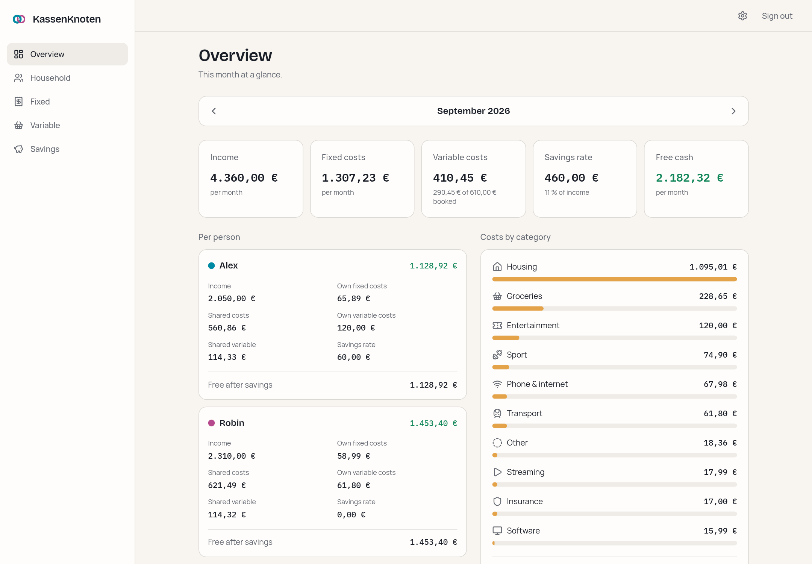
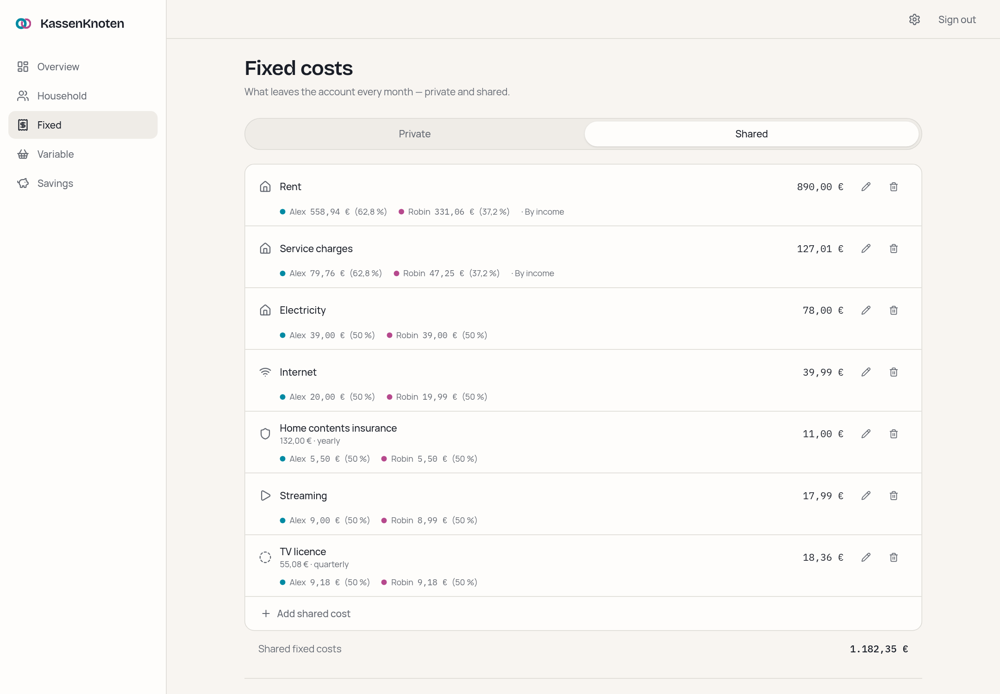
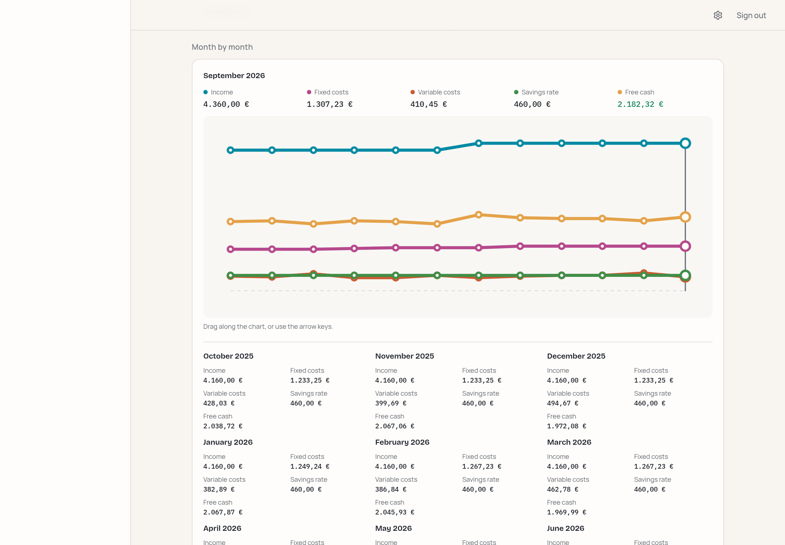
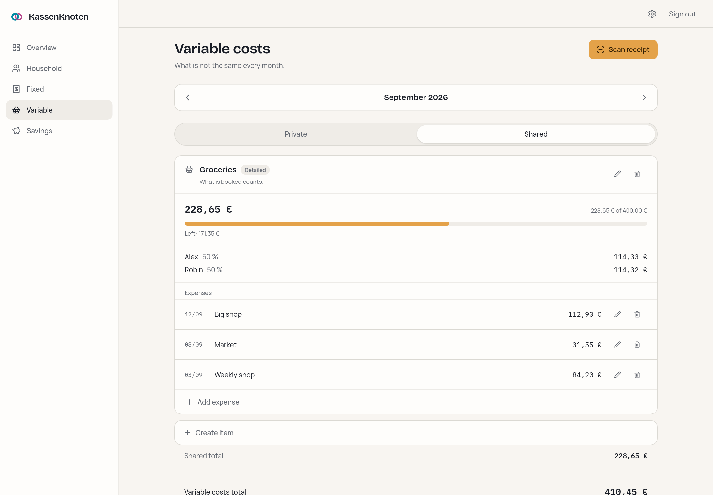
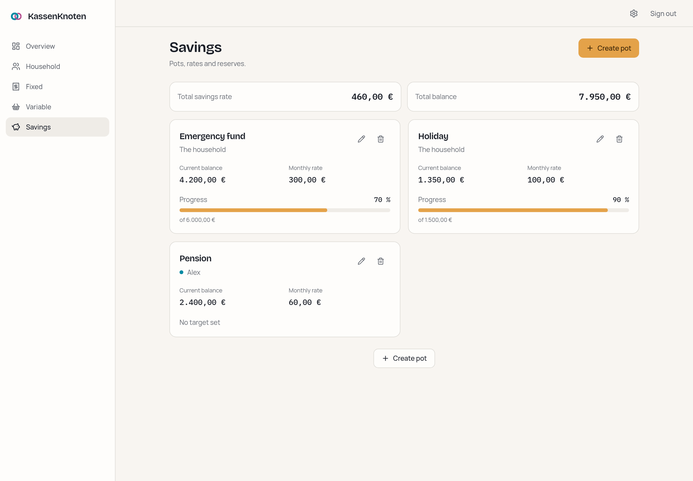
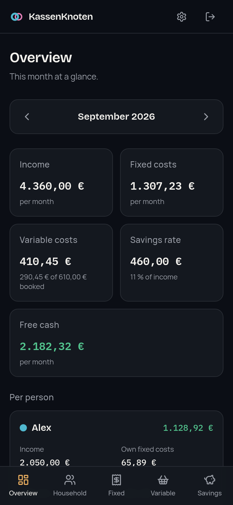
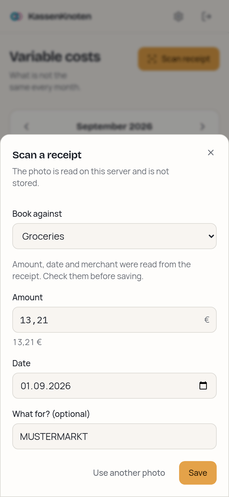
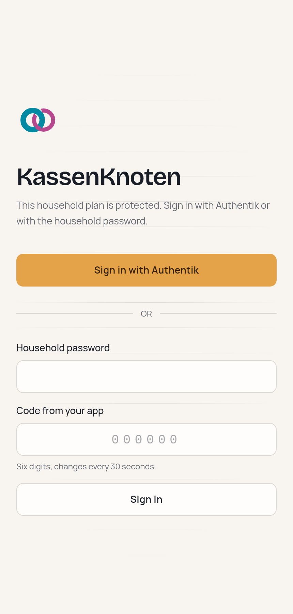
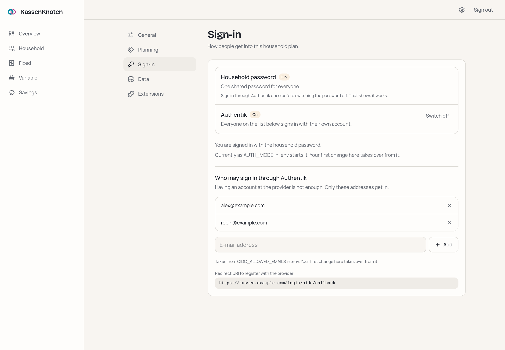

<div align="center">


# KassenKnoten

### Zwei Einkommen, ein Haushalt, ein klarer Plan.

A self-hosted household finance planner for people who share costs unevenly —
and want the maths to be exactly right.

**[→ See it in action](https://jankln.github.io/KassenKnoten/)** · [Features](#what-it-does) · [Run it](#run-it) · [Where it runs](#where-it-runs) · [Backups](#backups) · [Security](#security) · [Extensions](#extensions)

[](LICENSE)
[](https://github.com/jankln/KassenKnoten/releases/latest)
[](https://github.com/jankln/KassenKnoten/pkgs/container/kassenknoten)
[](https://github.com/jankln/KassenKnoten/actions/workflows/image.yml)
[](#a-note-on-language)

</div>

<br>



<br>

## The problem it solves

Two people earning different amounts share a flat. Rent should be split by income,
the electricity bill down the middle, the insurance is billed once a year, and one of
them pays for a gym the other never uses.

Every tool gets this half right. Splitting apps assume one rule for everything.
Spreadsheets can express it, but one wrong cell and the formula is quietly broken for
months. KassenKnoten makes the split **a deliberate choice per item**, computes it to
the cent, and shows both people what it actually costs them — while they type.

<br>

## What it does

|                               |                                                                                                             |
| ----------------------------- | ----------------------------------------------------------------------------------------------------------- |
| **Split per item**            | Fixed quota or proportional to income, chosen for each cost. The household default only pre-fills the form. |
| **Exact to the cent**         | Integer cents, basis points, largest-remainder splitting. No float ever touches money.                      |
| **A real time dimension**     | Every entry knows the months it applies to. A raise in September leaves August reporting August.            |
| **Month by month**            | Drag along the trend, or use the arrow keys, and the figures of any of the last twelve months follow.       |
| **Variable budgets**          | Groceries, fuel, going out — counted as a plan, or receipt by receipt with a date.                          |
| **Scan a receipt**            | Photograph it and the total, date and shop are filled in — read on your own server, never uploaded.         |
| **Every interval normalised** | A 132,00 € yearly insurance sits next to everything else as 11,00 € a month.                                |
| **Savings pots**              | Monthly rate, balance, optional target, owned by a person or by the household.                              |
| **Sign in your way**          | A household password with an optional second factor, Authentik or any OpenID Connect provider — or both.    |
| **Backed up every day**       | The server keeps the last fourteen states of your data in its volume, ready to download and restore.        |
| **Settings in one place**     | General, planning, sign-in, data and extensions, each on its own page.                                      |
| **Installable as an app**     | Own icon, no address bar, and an honest offline screen instead of stale figures.                            |
| **English and German**        | Chosen by the household, not the browser, so the tablet in the kitchen agrees with the laptop.              |
| **Extend it yourself**        | A single `.mjs` file, installed from the settings, adds your own cards to the overview.                     |

<br>

### Split each cost its own way

Fixed quota or proportional to income, **chosen per item, never assumed**. Every shared
cost shows who pays what and _why_ — rent by income, electricity down the middle. The
preview while you type is computed by the very same function that later saves, because a
preview that calculates a second way is a preview that can disagree with the result.



### Get the cents right

Every amount is stored as integer cents, every share as basis points, and splits use the
largest-remainder method — so 39,99 € at 50/50 becomes 20,00 € and 19,99 €, never
39,98 € or 40,00 €. No floating point touches money anywhere in the codebase, and the
calculation engine is a pure, unit-tested module.

### Keep the past honest

Every income and fixed cost carries the months it applies to. Giving someone a raise in
September leaves August reporting August, and the overview steps back through the months
to show what each one actually was. When an amount changes the app **asks what that
means** — a new figure from a month on, or a correction to what was always true — and
shows the resulting rows before saving.

The last twelve months sit in one chart on the overview. Drag along it, or use the arrow
keys, and a guide line and that month's five figures follow — no navigation, no page load.



### Plan the parts that move

Each variable cost gets a budget, and you choose per budget how it is kept. **Plan**
counts the figure you set and asks nothing more of you. **Detailed** counts what you
actually booked, receipt by receipt with a date, and turns the plan into a budget to
measure against. Both are split between you the same way fixed costs are, and both land
on the overview.



### Scan the receipt instead of typing it

**Scan receipt** opens the camera. The total, the date and the shop come back filled in,
and the only question left is which budget it belongs to — because the budget carries the
split, and a receipt that filed itself would be deciding who pays what. A field that could
not be read stays empty and says so; a total guessed rather than read off the `SUMME` line
is marked for a second look; nothing is booked until you press save.

It is read on your own server by an OCR engine inside the container, in German and English
at once. There is no key to configure and no service to trust, and the photo is dropped
the moment it has been read.

### Save on purpose, and stay out of trouble

Savings pots with a monthly rate, a balance and an optional target. Negative free cash, a
savings rate above income, a pot past its target, an overspent budget — surfaced as calm
banners, not modal scolding. Deleting shows a "Rückgängig" toast instead of asking "are
you sure?".



<br>

<table>
<tr>
<td width="33%" valign="top">



</td>
<td width="33%" valign="top">



</td>
<td width="33%" valign="top">



</td>
</tr>
<tr>
<td valign="top"><sub>Designed at 375 px first. Same features, not a shrunken desktop — and it installs to the home screen.</sub></td>
<td valign="top"><sub>A photographed receipt, read on your server: the total, the date and the shop, filled in for a check.</sub></td>
<td valign="top"><sub>Sign in with your identity provider, or with the household password and a one-time code.</sub></td>
</tr>
</table>

### All settings, sorted

Language and appearance, the default split and the cost categories, sign-in, backups and
extensions each have their own page, listed on one overview. On a wide screen the list
stays beside the page, so moving from sign-in to backups is one click.



<br>

## Run it

You need Docker and about two minutes. No checkout, no Node, no build.

### Where it runs

Anywhere Docker runs Linux containers. The image is published for **amd64 and arm64**, and
`docker pull` picks the right one by itself:

| Machine                                                                       | Image             |
| ----------------------------------------------------------------------------- | ----------------- |
| Linux server, mini PC or NUC with an Intel or AMD processor                   | `amd64`           |
| NAS and home-server systems on x86 — Synology, QNAP, Unraid, TrueNAS, Proxmox | `amd64`           |
| Raspberry Pi 4 or 5 with a **64-bit** OS, ARM cloud servers                   | `arm64`           |
| macOS with Docker Desktop — Apple silicon or Intel                            | `arm64` / `amd64` |
| Windows 10 or 11 with Docker Desktop (WSL 2) — Intel, AMD or Windows on ARM   | `amd64` / `arm64` |

Both images are started and used before every release: CI runs them on a native amd64 and
a native arm64 machine and walks the critical path in a browser against each — sign in,
set up a household, split a cost, read a receipt. Not supported: 32-bit ARM, such as a
Raspberry Pi running a 32-bit OS.

### Linux and macOS

```bash
mkdir kassenknoten && cd kassenknoten
curl -LO https://github.com/jankln/KassenKnoten/releases/latest/download/docker-compose.yml
curl -L -o .env https://github.com/jankln/KassenKnoten/releases/latest/download/env.example

# a session secret, appended to .env
docker run --rm ghcr.io/jankln/kassenknoten:latest node scripts/session-secret.ts >> .env

# your household password, hashed — paste the printed line into .env
docker run -it --rm ghcr.io/jankln/kassenknoten:latest node scripts/hash-password.ts

# optional: a second factor. Prints a QR code to scan and the line for .env
docker run -it --rm ghcr.io/jankln/kassenknoten:latest node scripts/totp-secret.ts

# optional: sign in with Authentik or another OIDC provider — see "Sign in with an
# identity provider" below, and fill in the OIDC_* block of .env

docker compose up -d
```

### Windows

Install [Docker Desktop](https://docs.docker.com/desktop/setup/install/windows-install/)
with the WSL 2 backend, then in **PowerShell**:

```powershell
mkdir kassenknoten; cd kassenknoten
curl.exe -LO https://github.com/jankln/KassenKnoten/releases/latest/download/docker-compose.yml
curl.exe -L -o .env https://github.com/jankln/KassenKnoten/releases/latest/download/env.example

# a session secret, appended to .env
docker run --rm ghcr.io/jankln/kassenknoten:latest node scripts/session-secret.ts | Add-Content .env

# your household password, hashed — paste the printed line into .env (notepad .env)
docker run -it --rm ghcr.io/jankln/kassenknoten:latest node scripts/hash-password.ts

# optional: a second factor. Prints a QR code to scan and the line for .env
docker run -it --rm ghcr.io/jankln/kassenknoten:latest node scripts/totp-secret.ts

docker compose up -d
```

`curl.exe`, not `curl`: in Windows PowerShell `curl` is a different command with other
options. `Add-Content` rather than `>`, which would write the file in an encoding Docker
Compose cannot read.

### Either way

The setup scripts run **inside the image**, so there is nothing to install to produce a
session secret, an argon2id hash or a TOTP secret — and they are the same on every system.

Open <http://127.0.0.1:3000> and a three-step wizard sets up the household. The database
is created, migrated and seeded on first use — there is no separate migration step.
Upgrading is editing the tag in `docker-compose.yml` and `docker compose up -d`.

<details>
<summary>Building it yourself instead</summary>

```bash
git clone https://github.com/jankln/KassenKnoten.git
cd KassenKnoten
cp .env.example .env
npm run auth:secret >> .env
npm run auth:hash
docker compose -f docker-compose.yml -f docker-compose.build.yml up -d --build
```

The override replaces the published image with a local build and tags it
`kassenknoten:local`, so the two never get confused in `docker images`.

</details>

Compose binds to localhost on purpose: put a reverse proxy in front for TLS, forward
`X-Forwarded-Proto` and `X-Forwarded-For`, and set `APP_URL` to the public HTTPS address
before anyone signs in.

### Backups

Once a day, when something has changed, the server writes a backup into `backups/` in the
data volume and keeps the last fourteen. They are the same versioned JSON as the download
under **Settings → Data**, where they are also listed: download one, choose it
under **Restore a backup**, done. A day on which nothing changed writes nothing, so the
fourteen are fourteen different states.

They live on the same disk as the database, which protects against a mistake, not against
the disk. Copy them off the machine now and then — from the host that is:

```bash
docker cp kassenknoten:/data/backups ./kassenknoten-backups
```

`BACKUP_KEEP` changes how many are kept (`0` switches them off), `BACKUP_DIR` where they go
— a mounted network share, for instance. A backup carries the household's data only: sign-in
settings and extension switches stay with the instance and are left alone by a restore.

## Sign in with an identity provider

Optional. If you run Authentik — or Keycloak, Pocket ID, Zitadel, anything that speaks
OpenID Connect — the household can sign in with it instead of, or next to, the shared
password. Nobody who does not configure it notices it exists.

**Before the first start** it is decided in `.env`: the `OIDC_*` block says how to reach
the provider, and `AUTH_MODE` says what is switched on — `local` (the password), `oidc`
(the provider only) or `both`.

**After install** it is decided under **Settings → Sign-in**: switch the password and the
provider on or off, and keep the list of e-mail addresses that may come in through the
provider. The first change there takes over from `AUTH_MODE` and `OIDC_ALLOWED_EMAILS`,
and the card says which of the two currently applies. A provider can sit in `.env`
switched off and be turned on from the settings later, without a restart.

Setting it up in Authentik:

1. **Applications → Applications → Create with provider**, provider type
   **OAuth2/OpenID Connect**.
2. Client type **Confidential**. Redirect URI, strict:
   `https://kassen.example.com/login/oidc/callback` — your `APP_URL` followed by
   `/login/oidc/callback`. The settings card shows the exact value.
3. Pick a **signing key**. Without one Authentik signs ID tokens with the client secret
   instead of a published key, and they cannot be verified here.
4. Keep the default scopes `openid`, `email` and `profile`.
5. Copy the values into `.env`:

```env
AUTH_MODE=both
OIDC_ISSUER=https://auth.example.com/application/o/kassenknoten/
OIDC_CLIENT_ID=...
OIDC_CLIENT_SECRET=...
OIDC_PROVIDER_NAME=Authentik
OIDC_ALLOWED_EMAILS=alex@example.com, robin@example.com
```

The issuer must match what Authentik publishes character for character, trailing slash
included; the app names the mismatch in its log if it does not. Addresses the provider
marks as `email_verified: false` are refused.

Having an account at the provider is not enough to get in: only addresses on the
allowlist are. Taking someone off the list, or switching a method off, ends the sessions
it issued on their next request — not when the week-long cookie happens to expire.

The settings will not let you lock yourself out: at least one method stays on, the method
you are signed in with cannot be switched off from that session, and your own address
cannot be removed from the list. If the provider breaks while it is the only way in,
remove `OIDC_ISSUER` and `OIDC_CLIENT_ID` from `.env`, set `AUTH_MODE=local` with a
`LOCAL_PASSWORD_HASH`, and restart — the password works again.

## Security

One shared household password, hashed with **argon2id** at OWASP interactive parameters
and supplied through the environment — a copy of the database is not a copy of the
password. Sign-in attempts are throttled per client.

Optionally a **second factor**: set `TOTP_SECRET` and the login also asks for a six-digit
code from any authenticator app (RFC 6238, verified against the RFC's own test vectors).
A code is refused once it has been used, so one read over your shoulder is not one that
still works. The secret lives in the environment like the password does, which means
losing the phone is not a lockout and there are no recovery codes to keep safe.

Optionally **OpenID Connect**: authorization code flow with PKCE, the ID token verified
against the provider's published keys (issuer, audience, expiry, nonce), and the e-mail
matched against an allowlist kept in the app. The client secret lives in the environment,
not the database. Written against `jose` directly rather than a client library, so every
check is in [`lib/auth/oidc.ts`](lib/auth/oidc.ts) and covered by a test.

The session is an **encrypted** cookie (JWE, A256GCM, key derived via HKDF), `httpOnly`,
`SameSite=Lax`, and `Secure` whenever the request arrived over HTTPS. Every route except
the login page and the health check is denied without a valid session — deny by default,
so a new page cannot accidentally be public — and server actions re-check server-side.

Every response carries a **Content-Security-Policy with a per-request nonce**, plus
`frame-ancestors 'none'`, `Referrer-Policy`, `X-Content-Type-Options`, a
`Permissions-Policy` denying camera, microphone and location, and HSTS over HTTPS.
Nothing loads from another origin — fonts included.

The container runs as an unprivileged user. Members are plain data records; adding
someone to the household does not create an account.

## Built with

Next.js 16 (App Router, Turbopack) · TypeScript · Tailwind CSS · SQLite via Drizzle ORM ·
argon2id · jose · Tesseract · Vitest · Playwright. No animation library, no CDN, no
telemetry — and no calls to anywhere at runtime, unless you configure an identity provider
for it to talk to.

## Status

**Stable.** Everything described here works and is in daily use. The data model, the backup
format and the environment variables are settled; they change by migration, not by
surprise, and breaking changes wait for a major version. What changed when is in the
[releases](https://github.com/jankln/KassenKnoten/releases).

## Extensions

You can add your own code. An extension is a single `.mjs` file, installed under
**Settings → Extensions**, that contributes cards to the overview. Two things to read:

- **[The extension guide](docs/extensions/README.md)** — the manifest, what `api` hands
  you, and how a card is drawn in the app's own design language.
- **[`savings-runway.mjs`](docs/extensions/savings-runway.mjs)** — a working example, and
  the shortest way to your own: copy it, change the id, upload it.

Be clear about what that means: an extension runs **on the server, inside the application
process, with full access to your household's database**. There is no sandbox. Installing
one is installing software on your machine, and the upload form says so before it accepts
a file. `EXTENSIONS_ENABLED=false` loads none of them, which is the way out if one breaks
the app badly enough that you cannot reach the settings screen.

## A note on language

The interface speaks **English and German**. A fresh instance starts in English; the setup
wizard asks which you would rather have before it asks anything else, and the settings
screen changes it later. The choice belongs to the household, not to a browser, so the
tablet in the kitchen agrees with the laptop.

Both message sets live in `lib/i18n/`, and English is the canonical one: the German file is
typed against it, so the build fails if a translation falls behind. There is no
"I will translate it later".

The code, the documentation and this README are English, so anyone can run and modify it.
The landing page comes in both: [English](https://jankln.github.io/KassenKnoten/) and
[Deutsch](https://jankln.github.io/KassenKnoten/de/), each showing screenshots of the
interface in that language.

## Contributing

Issues and pull requests are welcome. `docs/PLAN.md` covers the architecture and data
model, `docs/design.md` the visual direction and the reasoning behind it,
`docs/WORKFLOW.md` how changes are made, and
[`docs/extensions/`](docs/extensions/README.md) how to add your own code without touching
this repository at all.

`npm run check` — typecheck, lint, format and the full test suite — must pass, and nothing
is finished until it works at 375 px. `npm run test:e2e` walks the critical path in a real
browser at that width, against the standalone build (`BUILD_STANDALONE=1 npm run build`
first). CI runs both before any image is built.

## License

MIT — see [LICENSE](LICENSE). Do what you like with it.
